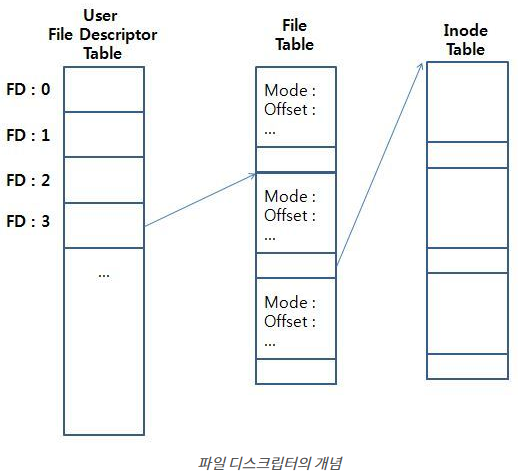
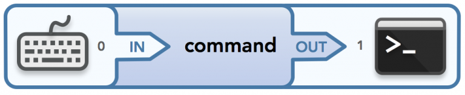
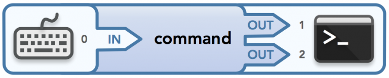
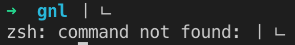
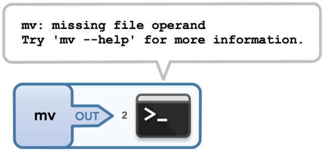
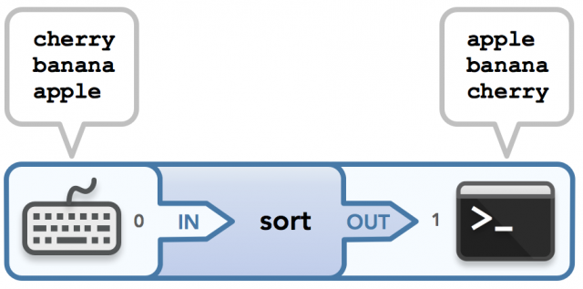

# File Descriptor

유닉스
- 입력(input)
  - 터미널 키보드와 연결
- 출력(output)
  - 터미널 디스플레이와 연결

파일 디스크립터
- 시스템으로부터 할당 받은 파일을 대표하는 음수가 아닌 정수값
- 프로세스에서 열린 파일의 목록을 관리하는 테이블의 인덱스

유닉스 시스템은 모든 것을 파일로써 관리한다.
- 정규 파일(Regular File)
- 소켓(Socket)
- 파이프(PIPE)
- 블록 디바이스
- 캐릭터 디바이스

이 모든 파일들을 접근할 때에 파일 디스크립터라는 개념을 이용
- 디스플레이에 데이터를 쓰는 것은 스크린 위에서 데이터 디스플레이를 담당하는 어떤 파일에 데이터를 쓰는 것과 같다.
- 키보드에서 데이터를 읽어오는 것은 키보드를 나타내는 어떤 파일에서 데이터를 읽어오는 것과 같다.

프로세스가 파일을 Open하는데 요청을 성공했다면, 커널은 커널의 global file table에서 비어있는 인덱스 중 가장 작은 음수가 아닌 정수값을 할당해준다.
- 그 후에 프로세스가 열려있는 파일에 시스템 콜을 이용해서 접근하면, 할당된 파일 디스크립터 값을 이용해 파일을 가리킨다.

프로그램이 프로세스로 메모리 실행 시작할 때
- 기본적으로 할당되는 파일 디스크립터
  - 0
    - 표준 입력(Standard Input)
  - 1
    - 표준 출력(Standard Output)
  - 2
    - 표준 에러(Standard Error)
  - 3 ~ OPEN_MAX
    - OPEN_MAX 값은 플랫폼에 따라 다름




파일 디스크립터가 숫자인 이유
- 프로세스가 유지하고 있는 FD 테이블의 인덱스이기 때문
  - FD 테이블의 각 엔트리는 FD에 대한 동작 제어 플래그와 열린 파일을 참조하는 포인터를 가지고 있다.
    - 포인터가 있으므로 FD를 통해 이 포인터를 참조하는 것이다.
- 프로세스는 FD 테이블과 파일 테이블의 정보를 직접 고칠 수 없다.
  - 무조건 커널을 통해 수정해야 한다.

File Table(open file description)
- 현재 파일의 정보를 담고 있다.
  - offset
  - flag
  - 접근 모드
  - i/o 관련 설정
  - 파일의 i-node 객체를 가리키는 레퍼런스

Inode Table
- 파일 종류(일반 파일, 소켓, fifo)와 권한
- lock 목록 포인터
- 다양한 파일 속성(크기, 타임 스탬프 등)

# read 함수

open() 함수로 열기한 파일의 내용을 읽는 함수

```c
ssize_t read(int fd, void *buf, size_t nbytes)
```

- 헤더
  - unistd.h
- 인수
  - fd
    - 파일 디스크립터
  - buf
    - 파일을 읽어 들일 버퍼
  - nbytes
    - 읽어 들일 버퍼의 크기
- return
  - 실패
    - -1
  - 성공
    - 읽어들인 바이트 수

읽어들일 버퍼의 크기가 파일보다 크다면 파일의 모든 내용을 읽어들이고, 작다면 버퍼 크기만큼만 읽는다.
- 파일에 읽을 바이트가 더 이상 없다면 에러 처리하지 않고, 파일의 끝(EOF)을 알려주기 위해 0을 반환한다.
  - EOF는 읽을 데이터가 없다는 것과는 다른 의미다.
- 만약 읽을 데이터가 없다면 read() 함수는 읽은 바이트가 생길 때까지 블록된다.
  - 이 경우는 읽기 과정에서 더 많은 데이터를 기다리는 것을 의미한다.
  - 이 블록킹을 막기위해서 읽을 데이터가 없을 때 즉시 반환해주는 옵션을 넣어주면된다.(논블록 입출력)
    - 파일을 open할 때 옵션으로 O_NONBLOCK을 넘겨주면 된다.
    - 만약 읽을 데이터가 없다면 read() 함수는 -1이 반환한다.

# Data Flow(데이터 흐름)

데이터는 바이트를 한 곳에서 다른 곳으로 전송하는 스트림(streams)을 통해 흐른다.
- 기본적으로 스트림들은 각자의 특정 파일 디스크립터를 갖고 있다.
  - 각 스트림은 자신에게 맵핑된 파일 디스크립터에게 보낸 데이터가 어디로 가는지 또는 그 FD로부터 받은 데이터가 어디로부터 오는지 알 지 못한다.
    - 스트림은 단지 자신의 FD를 통해 데이터를 전송한다.
      - 실제로 데이터 리소스를 직접 처리하는 것이 아니다.

데이터 흐름의 입력(stdin을 통해 기본적으로 키보드로부터 들어오는 데이터)과 흐름의 출력(stdout을 통해 또는 오류가 발생하면 stderr를 통해 기본적으로 터미널에게 전달되는 데이터)을 나타내기 위해 다음의 다이어그램을 사용한다.



- 키보드가 명령을 수행하는 프로그램을 데이터에게 전달
  - 데이터 입장에서는 stdin을 통해 입력을 전달받는 것
- 그 프로그램은 stdout을 통해 터미널에 데이터를 출력
- 각 입력과 출력에 대응되는 파일 옆에는 파일 디스크립터 (0, 1)이 쓰여있다.

>터미널로 출력할 수 있는 스트림은 기본적으로 2가지이다.(stdout, stderr)



stderr
- 명령을 실행시킬 때 오류가 있을 경우 사용된다.


- 두 번째 줄을 출력하기 위해 사용된 스트림이 stderr이다.

명령의 옵션 인자들(option arguments)은 커맨드 라인으로부터 읽히지만, 실제 입력(input)은 파일 디스크립터와 연결된 오픈 파일(open file)로부터 읽힌다.
어떤 파일 인자가 명령에 전달되었을 때, 프로세스가 실질적으로 그 파일의 컨텐츠를 읽거나 변경할 경우 그것을 입력으로 생각할 것이다. 하지만 단순히 그 파일을 참조하는 경우에는 입력으로 간주하지 않는다.
- 입력은 없지만 출력은 있는 명령
  - mv
    - 전달되는 파일의 컨텐츠가 읽히거나 또는 사용되는 것이 아니기 때문에 전달된 파일은 입력(input)이 아니다.



- 입력과 출력을 모두 사용하는 명령
  - sort
    - 입력된 스트링들이 stdin을 통해 명령을 실행하는 프로세스에게 전달되고, 그 프로세스에 의해 정렬된 후, stdout을 통해 터미널로 출력된다.



# static 변수

static 변수
- 지역변수와 전역변수의 성질을 모두 지님
  - 지역변수처럼 선언된 함수 내에서만 사용 가능
    - but, 지역변수와는 달리 함수가 반환되더라도 소멸되지 않고, 메모리 공간에 남아있는다.
  - 전역변수처럼 프로그램이 종료될 때까지 메모리 공간(data 영역)에 존재한다.
    - 컴파일 시간에 data 영역에 메모리를 할당하여 저장되고 프로그램이 끝나면 자동 삭제된다.
    - but, 전역변수와는 달리 함수 내에서만 접근이 가능하다.
- static 변수는 초기화하지 않으면 0으로 초기화된다.